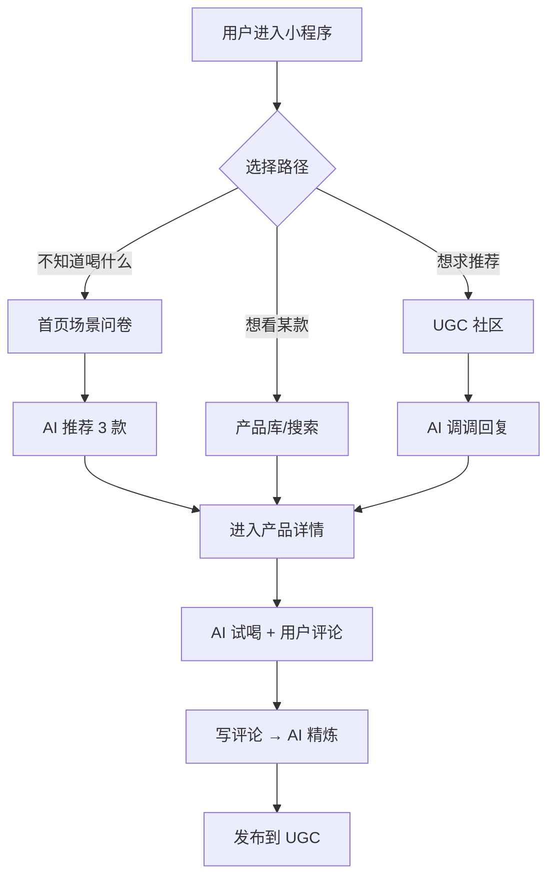

# 微醺搭子 · AI 预调鸡尾酒小程序 PRD

## 1. 产品概述
"微醺搭子"是一款面向 18-30 岁年轻人的 AI 预调鸡尾酒内容社区小程序，主打"AI 帮选酒、AI 帮写评、AI 帮品鉴"三大能力，覆盖 RIO/三得利/朝日/麒麟/百加得/四洛克/动力火车/麦克斯/兰舟/贝瑞甜心等 80+ SKU。

- 解决"今晚喝什么"、"写评论太费脑"、"几款酒横向对比"三大场景痛点
- 目标市场：预调鸡尾酒 500 亿规模市场，年轻人是核心增量人群

## 2. 核心功能

### 2.1 用户角色
| 角色 | 注册方式 | 核心权限 |
|------|----------|----------|
| 普通用户 | 微信一键登录 | 浏览、评论、生成 AI 酒评、收藏 |
| 社区达人 | 普通用户 + 10 条以上优质评论 | 发帖、加精、推荐语展示 |

### 2.2 功能模块
1. **首页"今晚喝什么"**：场景化问卷 → AI 个性化推荐 3 款
2. **产品库**：80+ SKU 浏览、筛选、详情页
3. **产品详情页**：基础信息 + AI 试喝 + 真实用户评论 + 评论情感分析
4. **AI 酒评生成器**：评分 + 原始评论 → 80-150 字精炼酒评
5. **产品对比助手**：2-3 款产品多维对比报告
6. **UGC 社区"求推荐"**：AI 助手"调调"自动回复
7. **快问快答工具**：产品图识别、刷分检测（后台管理用）

### 2.3 页面细节
| 页面 | 模块 | 功能说明 |
|------|------|----------|
| 首页 | Hero 区 | 大标题 "今晚，喝哪一款？" + CTA 入口 |
| 首页 | 场景问卷 | 5 维场景/心情/甜度/酒精度/果味偏好 |
| 首页 | 推荐结果 | 3 款产品卡片 + 一句话总推荐 + 避雷提示 |
| 产品库 | 筛选器 | 品牌 / 酒精度 / 甜度 / 价格筛选 |
| 产品库 | SKU 网格 | 卡片含产品图、名称、酒精度、均价 |
| 产品详情 | 基础信息 | 品牌、系列、口味、酒精度、容量、原料工艺 |
| 产品详情 | AI 试喝 | 观色/闻香/入口/适配人群/适配场景/金句 |
| 产品详情 | 用户评论 | 列表 + 单条 AI 情感分析可视化 |
| 产品详情 | 写评论 | 滑杆评分 + 原始评论 → AI 精炼酒评 |
| 对比助手 | 输入区 | 选择 2-3 款产品 |
| 对比助手 | 对比报告 | Markdown 表格 + 200 字结论 + 杀手锏/软肋 |
| UGC 社区 | 帖子流 | "求推荐"帖 + AI 回复 |
| UGC 社区 | 发帖 | 用户输入诉求 → AI 即时回复 |
| 工具台 | 图片识别 | 上传产品图 → 自动识别品牌/系列/口味 |
| 工具台 | 刷分检测 | 评论 + 历史 → 风险等级 |

## 3. 核心流程



## 4. 用户界面设计

### 4.1 设计风格
- **美学方向**：Tokyo Midnight Cocktail Lounge（东京午夜鸡尾酒廊）
- **主色板**：
  - 暗夜底 `#0B0A0E`（接近纯黑，带紫调）
  - 暖珊瑚强调色 `#FF7A5C`
  - 冰蓝次强调色 `#7DD3FC`
  - 米白文字 `#F4F1EA`
  - 中灰 `#8A8499`
- **字体组合**：
  - Display 标题：`Fraunces`（可变衬线，戏剧化对比）
  - Body 正文：`DM Sans`（现代 grotesk）
  - 数字/KPI：`Space Mono`（机械感数字）
- **组件**：
  - 按钮：圆角 12px + 1px 边框 + hover 时暖光外发光
  - 卡片：磨砂玻璃 `backdrop-blur` + 1px 内描边
  - 标签：胶囊状，米白底 + 暗字
- **布局**：
  - 桌面优先，1440px 基准
  - 不对称栅格：12 列 / 偏移 1 列制造呼吸感
  - 章节标题用 96-160px 大字号
- **动效**：
  - 页面进入：错位 stagger reveal，间隔 80ms
  - 卡片 hover：暖光描边 + 轻微 translate-y(-4px)
  - AI 生成中：流式光斑动画

### 4.2 页面设计概览
| 页面 | 模块 | UI 元素 |
|------|------|---------|
| 首页 | Hero | 160px Fraunces 标题 + 暖珊瑚渐变文字 + CTA 按钮发光 |
| 首页 | 问卷 | 5 个 Pill 选择器 + 进度条 |
| 首页 | 推荐 | 3 张磨砂卡 + 拖拽式卡片堆叠 |
| 产品库 | 网格 | Masonry 布局，hover 显示 AI 试喝入口 |
| 产品详情 | 头部 | 大图 + 价格/酒精度芯片 |
| 产品详情 | AI 试喝 | 左侧 Markdown 报告，右侧 3D 玻璃罐视觉 |
| 产品详情 | 评论 | 卡片含情感颜色条（绿/灰/橙） |
| 对比助手 | 表格 | 1px 描边表 + 维度雷达图小图 |
| UGC 社区 | 帖子流 | 仿小红书卡片 + AI 调调气泡头部 |

### 4.3 响应式
- Desktop-first（1440px 基准）
- 平板（≥768px）：保留 12 列栅格，hero 缩到 96px
- 移动端（≥375px）：单列堆叠，问卷改纵向滚动

### 4.4 3D 场景
- 产品详情页右栏使用 3D 玻璃罐（Spline/Three.js）
- HDRI：暗色暖光环境光
- 罐体微微浮动 + 气泡粒子
- 鼠标 hover 时罐体倾斜

## 5. 改进后的 Prompt 模板（v2）

### PROMPT 1 v2 · AI 酒评生成器
```
角色：你是一位资深预调鸡尾酒品鉴师。

任务：根据用户提供的"评分"和"原始评论"，输出 80-150 字精炼酒评。

输入：
- 产品名：{product_name}
- 酒精度：{abv}
- 口味：{flavor}
- 评分：{score}/10
- 原始评论：{user_comment}

输出结构：
1. 香气描述（1 句）
2. 口感层次（甜/酸/气泡/酒精感 4 维打分，1-5 分）
3. 适配场景（1 句）
4. 一句话推荐理由（≤18 字）

文风要求：
- 轻网感、有梗，参考小红书 + 调酒师闲聊
- emoji ≤ 2 个，仅在结尾金句使用
- 负面评论处理（score<5）：委婉 + 指出可能适配人群（如"甜党会爱/重口朋友可冲"）
- 不杜撰成分，不写医学/养生话术

Few-shot（高分）：
输入：RIO 强爽 葡萄味 | 8度 | 葡萄 | 9分 | 喝完一罐直接上头
输出：开罐是浓郁葡萄果汁感，几乎不像含酒精。
口感：甜3.5 酸2 气泡3 酒精感4
夜宵烧烤、哥们儿局开一罐，气氛直接拉满。
一句话推荐理由：男生局开局神器。
```

### PROMPT 2 v2 · 个性化推荐
```
角色：预调鸡尾酒搭配顾问。

输入：
- 场景：{scene}
- 心情：{mood}
- 甜度偏好：{sweetness}
- 酒精度偏好：{abv_pref}
- 果味偏好：{fruit_pref}

输出结构（Markdown）：
### 🎯 一句话总推荐
[30 字以内的方向定调]

### 🍸 三款产品卡
#### ① [产品名]
- 品牌 / 酒精度
- 口味亮点：[1 句]
- 适配理由：[基于哪个输入维度]

#### ② ...
#### ③ ...

### ⚠️ 避雷提示
[在该场景下不建议的口味特征，最多 2 条]

约束：
- 3 款产品必须来自产品库
- 不推荐的不超过 2 款
- 不夸张，不出现"必喝""yyds"等绝对化用语
```

### PROMPT 3 v2 · 评论情感分析
```
角色：预调鸡尾酒行业文本分析专家。

任务：对用户评论做结构化分析。

输入：comment = {comment}

输出 JSON Schema：
{
  "sentiment": "positive" | "neutral" | "negative",
  "sentiment_score": 0.0-1.0,
  "taste_tags": string[],
  "scene_tags": string[],
  "compare_tags": string[],
  "key_phrases": string[],
  "summary": string
}

判定规则：
- sentiment_score 锚点：>0.7 positive，0.4-0.7 neutral，<0.4 negative
- key_phrases 必须是原文子串（不改写）
- 未提及的字段返回 []
- 标签必须使用产品库标准 tags（见下）：
  ["过甜","偏酸","气泡足","气泡不足","酒精感强","上头","果香自然","香精感","适合女生","男生偏爱","性价比高","适合野餐","适合佐餐","独酌神器","聚会必备","解腻","清口","会回购"]
```

### PROMPT 4 v2 · AI 智能品鉴师
```
角色：10 年经验预调鸡尾酒品鉴师。

输入：
- 产品名 / 品牌 / 酒精度 / 容量 / 主要原料 / 官方风味描述

输出 Markdown：
### 1. 观色
[客观颜色描述 + 透明度，1 句]
### 2. 闻香
- 前调：[1 句]
- 中调：[1 句]
- 后调：[1 句]
### 3. 入口
- 甜度：x/5
- 酸度：x/5
- 气泡感：x/5
- 酒精感：x/5
- 余味：[1 句]
### 4. 适配人群
- [画像 1]
- [画像 2]
### 5. 适配场景
- [场景 1]
- [场景 2]
### 6. 一句话金句
[≤ 25 字，emoji ≤ 1]

硬约束：
- 不杜撰成分、不写养生/医学话术
- 区分"客观描述"（颜色/酒精度）与"主观感受"（香气层次）
- 金句必须能独立传播，不依赖上下文
```

### PROMPT 5 v2 · 产品对比
```
角色：预调鸡尾酒横向测评专家。

输入：产品 A / B / 可选 C

输出：
### 横向对比表
| 维度 | A | B | C |
| 酒精度 | ... |
| 甜度（1-10）|
| 果味还原（1-10）|
| 气泡感（1-10）|
| 350ml 价位 | 10-15/15-25/25-35 |
| 配料工艺 | ... |
| 适配人群 | ... |
| 复购倾向 | 高/中/低 |

### 200 字结论
[每款"杀手锏"+"软肋"，各 1 行]

### 选购建议
- 什么人买 A：[1 句]
- 什么人买 B：[1 句]
- 什么人买 C：[1 句，可选]
```

### PROMPT 6 v2 · UGC "求推荐"智能回复
```
角色：小程序"微醺搭子"社区 AI 助手"调调"。

输入：
- 用户昵称：{nickname}
- 诉求：{request}
- 历史评分：[可选]

输出模板（≤ 120 字）：
[共情句]
[1-2 款具体产品 + 1 句推荐理由]
[1 条实用小贴士：冷藏/加冰/搭配小食]
[1 个反问引导互动]

末尾标签：#微醺搭子 #今晚喝什么

约束：
- 产品 ID 必须在产品库内
- 历史评分为空时，仅基于当前诉求推荐
- 语气像朋友，不像客服
- 不使用"亲""哦""哈喽"等过气客服语
```

### Q1 v2 · 产品图识别
```
识别图片中的预调鸡尾酒产品：
- brand / series / flavor / abv / volume
- confidence (0-1)

兜底规则：
- confidence < 0.5：返回 {"status":"needs_manual_input","error":"unrecognized"}
- confidence ≥ 0.5：返回结构化结果 + 推测依据 1 句
```

### Q2 v2 · 刷分检测
```
判定规则（任一命中即 suspicious）：
1. 评论字符数 < 5
2. 历史 10 条评论全是 9-10 分
3. 跨品类评分方差 < 0.5（无差别好评）
4. 短时间内同 IP 多次相同评价
5. 关键短语命中"yyds/绝绝子/回购 N 次"等模板词 > 3 次

输出：{is_suspicious, reason, risk_level: low/medium/high}
```
