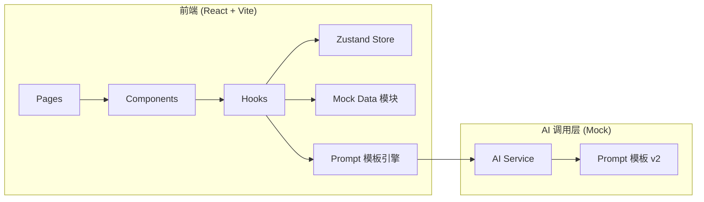

# 微醺搭子 · 技术架构

## 1. 架构设计



## 2. 技术栈
- **框架**：React@18 + TypeScript
- **构建**：Vite
- **样式**：Tailwind CSS@3 + 自定义 CSS 变量
- **路由**：react-router-dom@6
- **状态管理**：Zustand
- **图标**：lucide-react
- **3D**：Spline embed（演示罐体）/ Three.js
- **AI**：Mock 实现 + 流式输出模拟（用 setTimeout 分段输出）
- **字体**：Google Fonts（Fraunces / DM Sans / Space Mono）

## 3. 路由定义
| 路由 | 用途 |
|------|------|
| `/` | 首页"今晚喝什么" |
| `/library` | 产品库 |
| `/product/:id` | 产品详情（含 AI 试喝、写评论） |
| `/compare` | 产品对比助手 |
| `/community` | UGC 社区 |
| `/tools` | 快问快答工具（图片识别、刷分检测） |

## 4. 目录结构
```
cocktail-ai-demo/
├── src/
│   ├── components/        # 通用组件
│   ├── pages/             # 页面
│   ├── hooks/             # 自定义 hooks
│   ├── store/             # Zustand store
│   ├── data/              # Mock 产品库 JSON
│   ├── prompts/           # Prompt 模板 v2
│   ├── services/          # AI Mock Service
│   ├── utils/             # 工具函数
│   └── App.tsx
├── .trae/documents/       # PRD + 技术架构
├── index.html
└── package.json
```

## 5. 数据模型
### 5.1 产品
```ts
interface Product {
  id: string
  brand: string
  series: string
  product_name: string
  abv: number
  volume_ml: number
  flavor_tags: string[]
  base_spirit: string
  process: string
  origin: string
  tags: string[]
  scenes: string[]
  price_tier: 'low' | 'mid' | 'high'  // 350ml 价位
  description: string
  image_url: string
}
```

### 5.2 评论
```ts
interface Review {
  id: string
  product_id: string
  user_name: string
  user_avatar: string
  score: number
  raw_comment: string
  ai_review: string
  sentiment: 'positive' | 'neutral' | 'negative'
  sentiment_score: number
  taste_tags: string[]
  scene_tags: string[]
  created_at: string
}
```

## 6. AI Mock Service
所有 AI 调用都通过 `services/ai.ts` 统一封装：
- `generateReview(input)`：调用 PROMPT 1 v2
- `recommendProducts(input)`：调用 PROMPT 2 v2
- `analyzeComment(text)`：调用 PROMPT 3 v2
- `tastingNote(product)`：调用 PROMPT 4 v2
- `compareProducts(products)`：调用 PROMPT 5 v2
- `replyToPost(input)`：调用 PROMPT 6 v2
- `recognizeImage(image)`：调用 Q1 v2
- `detectFraud(review)`：调用 Q2 v2

实现策略：基于规则 + 模板字符串的 Mock 输出（不依赖真实 LLM），模拟流式响应。

## 7. 性能与可访问性
- 字体子集化，仅加载需要的字重
- 图片懒加载 + WebP
- ARIA 角色：所有交互按钮加 aria-label
- 键盘导航：所有页面 Tab 可达
- 减少动效：尊重 `prefers-reduced-motion`
